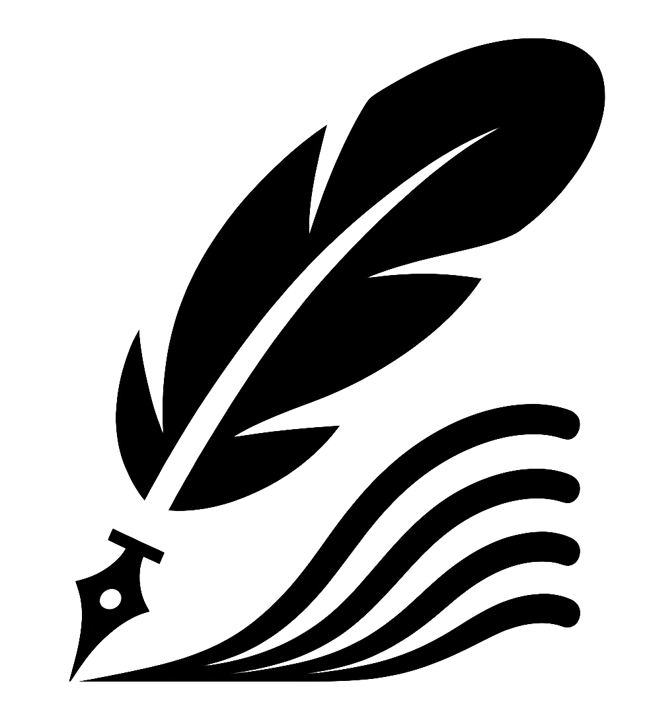
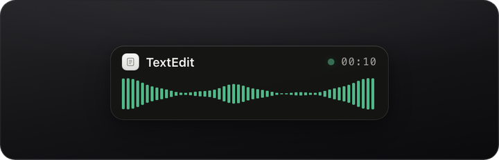
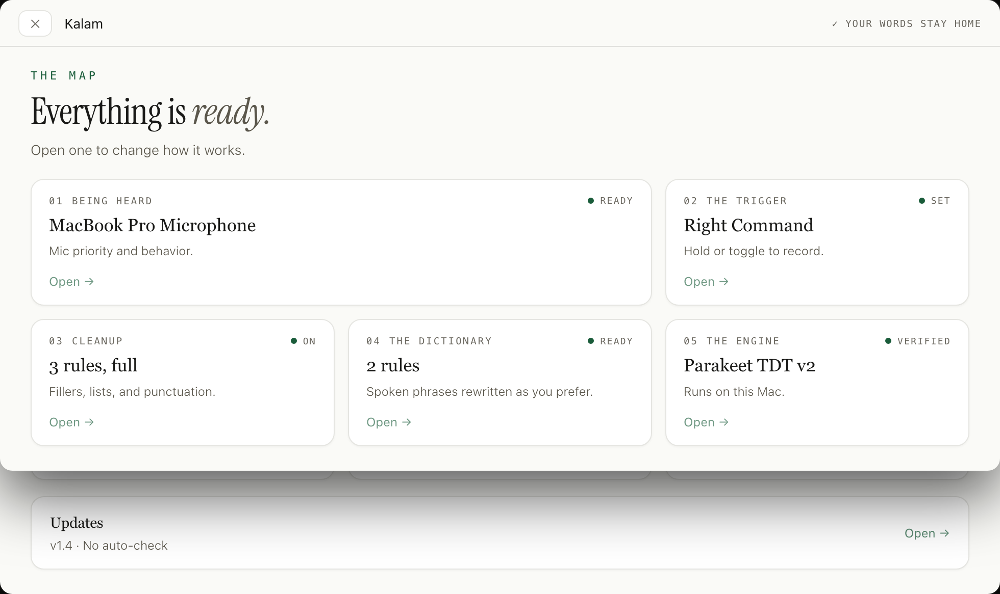
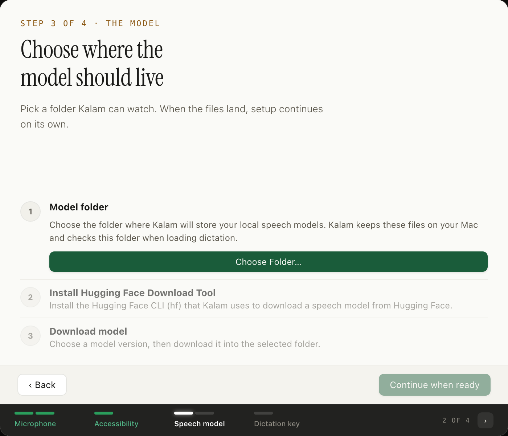
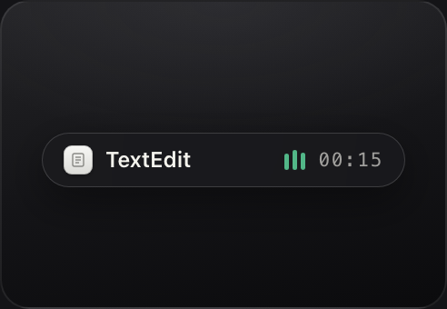

<p align="center">
  <picture>
    <source media="(prefers-color-scheme: dark)" srcset="assets/quill-logo-dark.png">
    
  </picture>
</p>

<h1 align="center">Speak messy. Type clean <em>(privately)</em>.</h1>

<p align="center">
  A dictation app that knows &ldquo;um&rdquo; isn&rsquo;t a word and &ldquo;scratch that&rdquo; is an instruction.
</p>

<p align="center">
  
</p>

<p align="center">
  <a href="https://github.com/singhkays/Kalam/releases/latest"></a>
  
  
  <a href="https://github.com/singhkays/Kalam/releases/latest"></a>
</p>

<p align="center">
  <a href="https://github.com/singhkays/Kalam/releases/latest"><strong>Download for macOS</strong></a>
  &nbsp;&middot;&nbsp;
  <a href="#install--first-run">Setup takes about two minutes</a>
  &nbsp;&middot;&nbsp;
  <a href="https://github.com/singhkays/Kalam">Source</a>
</p>

---

## Why Kalam

Most dictation apps hand you the raw transcript and make you clean it up yourself. Kalam does the cleanup as part of dictation, so what lands in your app is already written.

**It edits what you actually said.** Standalone fillers go, spoken corrections take effect, and rundown lists turn into real lists.

**It learns your vocabulary.** A personal dictionary rewrites the words you mispronounce or the names only you use, with smart casing, every time.

**It never sends anything anywhere.** There is no network entitlement in the app bundle. Not &ldquo;we don&rsquo;t send it&rdquo; &mdash; the app is physically incapable of sending it.

## What it actually does

Every row below is real output from the cleanup engine, not a mockup.

| | You say | Kalam types |
|---|---|---|
| **Fillers** | `um I think uh we should ship it on Friday` | `I think we should ship it on Friday` |
| **Backtracks** | `send the invoice today scratch that send it next Monday` | `send it next Monday` |
| **Spoken lists** | `the plan is one gather logs two isolate the bug three ship the fix` | `the plan is`<br>`1. gather logs`<br>`2. isolate the bug`<br>`3. ship the fix` |
| **Punctuation** | `hello ,world!!this is fine` | `hello, world! this is fine` |
| **Your dictionary** | `my iphone broke` | `my iPhone broke` |

Two details worth knowing. Fillers are removed as whole words only, so `mum` and `aluminum` survive. And a spoken list is validated before it's formatted, so a stray number won't scramble the list it was meant to be part of.

Also available: optional written-form conversion for spoken numbers and dates (on-device, off by default), and optional sentence-level grammar cleanup.

## Works wherever you can type

Kalam injects text at the system level into whatever is focused. Slack, Notion, Xcode, Terminal, email, browsers, code editors, design tools &mdash; anywhere there's a caret.

<p align="center">
  
</p>

## Privacy you can verify

Privacy claims are cheap. This one is checkable.

- **No network entitlement.** `com.apple.security.network.client` is absent from `app/Kalam/Kalam.entitlements`. The app bundle cannot open a network connection. See [`app/docs/SECURITY.md`](app/docs/SECURITY.md).
- **Everything runs on device.** Speech recognition uses Parakeet CoreML models on the Apple Neural Engine.
- **Audio is wiped after use.** Recording buffers are securely zeroed once transcription completes.
- **Nothing is logged.** Transcript and audio content are never written to disk. Logs carry counts and timings only.
- **No accounts, no telemetry, no analytics.**

You can read the source and check all of this yourself. That's what the [MIT license](LICENSE) is for.

## Install &amp; first run

**1. Open it.** Kalam is an independent project and is not distributed through the Mac App Store, so Gatekeeper will stop you the first time. Right-click (or Control-click) the Kalam app, choose **Open**, then **Open** again. You only do this once.

**2. Follow the setup.** Kalam walks you through four steps:

- **Microphone** &mdash; required for capture. Choose from your connected inputs.
- **Accessibility** &mdash; required for Kalam to type into other apps.
- **Hotkey** &mdash; pick your trigger.
- **Model** &mdash; point Kalam at a folder to hold the speech model.

<p align="center">
  
</p>

**3. Download a model.** Kalam is compiled without network access, so it can't fetch a model for you. It shows you the exact command and you paste it into Terminal yourself &mdash; the app never runs shell commands.

```bash
# install the Hugging Face CLI once
brew install hf

# then run the command Kalam shows you in Settings
hf download FluidInference/parakeet-tdt-0.6b-v2-coreml \
  --include "Preprocessor.mlmodelc/*" \
  --include "Encoder.mlmodelc/*" \
  --include "Decoder.mlmodelc/*" \
  --include "JointDecision.mlmodelc/*" \
  --include "*vocab.json" \
  --local-dir '/path/to/your/models/parakeet-tdt-0.6b-v2'
```

Pick the destination folder in **Settings &rarr; Models** first, then copy the command it generates. It always matches the model you selected.

### Models

You choose which one to install:

| Model | Languages | Size | Notes |
|---|---|---|---|
| Parakeet TDT v2 | English | ~450 MB | Highest accuracy (2.1% WER) |
| Parakeet TDT v3 | 25 European languages | ~450 MB | 2.5% WER |
| Parakeet TDT-CTC 110M | English | ~220 MB | Fastest, lowest memory (3.6% WER) |

## Trigger modes

| Mode | Behavior |
|---|---|
| **Hold or Toggle** | Hold the key to record; a quick tap toggles. The default. |
| **Hold** | Record only while the key is down. |
| **Toggle** | Press once to start, press again to stop. |
| **Double Tap** | Tap twice quickly to start and stop. |

Trigger keys include the right-hand modifiers (Right Command, Right Option, Right Shift, Right Control) and common combinations.

## Recording indicator

The indicator shows what the app is doing at every step, and it's visible in your app rather than hidden in a menu.

| State | What you see |
|---|---|
| **listening** | Your app name and a live waveform |
| **pausing** | You went quiet; the mic is still open |
| **transcribing** | The engine is working |
| **held** | Your text is ready, with **Paste** and **Discard** |
| **blocked** | The microphone isn't available, with a shortcut to Settings |

<p align="center">
  
</p>

## Updates

Kalam doesn't check for updates automatically, because that would require a network entitlement. To get the latest version, use **View Latest Release** in the menu bar item, or open the [releases page](https://github.com/singhkays/Kalam/releases/latest).

To hear about new releases without giving up that posture, watch the repository on GitHub: **Watch &rarr; Custom &rarr; Releases**.

## FAQ

**Does any of my data leave my Mac?**
No. Kalam is compiled without network entitlements. Audio is processed on-device and wiped from memory when transcription finishes. Nothing is transmitted, stored, or sent to anyone.

**Is it really free?**
Yes. MIT licensed, no subscriptions, no usage limits, no premium tier. Download it, read it, fork it.

**What happens when I go quiet?**
Nothing gets cut off. While you're silent the indicator drops to a low meter to show you're still being heard, and when you stop talking the whole take is processed at once. Silence at the edges is trimmed afterwards; a pause mid-sentence never ends the recording.

**Why won't Kalam paste into my password field?**
On purpose. It refuses secure text fields and any app with secure input active, so your transcript never lands on the pasteboard by accident.

**Does it need my password or any account?**
No. There is no account, no sign-in, and no server.

**What macOS versions are supported?**
macOS 14.6 or later. Apple Silicon is recommended.

## For developers

The architecture, runtime flow, and build/test instructions live in
[**app/docs/DEVELOPER_GUIDE.md**](app/docs/DEVELOPER_GUIDE.md).

```
app/                       macOS app (Swift 6, AppKit + SwiftUI)
app/Packages/KalamTextEngine/   cleanup engine + dictionary compiler
scripts/                   engine tests, README capture, model probes
landing-page/              Vite/React site
```

Run the engine tests without Xcode:

```bash
./scripts/test-engine.sh
```

## Contributing

Issues and pull requests are welcome. If you're proposing a change to the
dictation pipeline, please read [`AGENTS.md`](AGENTS.md) first &mdash; it
documents the invariants that must hold (no network code, no logging of
transcript or audio content, clipboard-restore semantics).

## License

MIT &mdash; see [LICENSE](LICENSE).